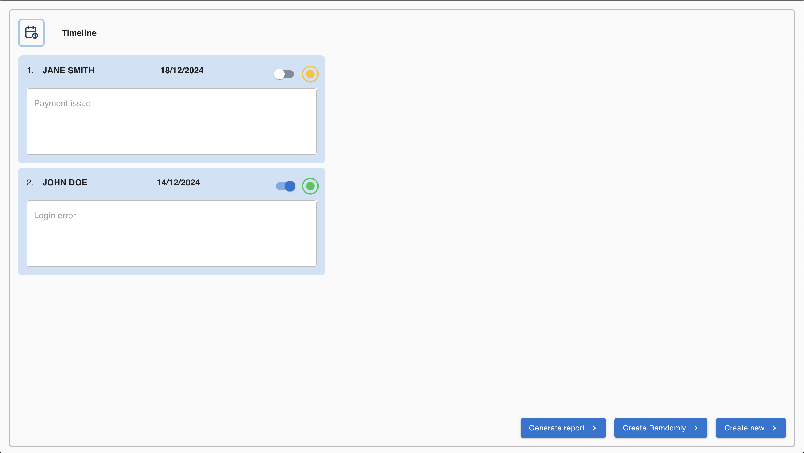

# Challenge: Building a Support Ticket System
This project focuses on solving the challenge of ticket management by developing a REST API for managing ticket information and a web frontend that consumes the API data.

## Backend
The backend was developed following Clean Architecture principles. Additionally, it adheres to SOLID and Clean Code principles to ensure maintainability, scalability, and readability.

### Project Sctructure
The backend project follows a structured and organized layout within the src directory:

```
src  
├── core  
│   ├── entities        # Domain entities or models representing business objects  
│   ├── repositories    # Interfaces/abstractions for data access operations  
│  
├── infra  
│   ├── model           # Database models or schemas  
│   ├── repositories    # Implementations of repository interfaces for data access  
│  
├── interface  
│   ├── adapters        # Mechanisms for data adaptation or transformations  
│   ├── controllers     # Application controllers handling business logic  
│   ├── http            # HTTP configurations, middleware, or request handlers  
│   ├── routes          # API routes mapping endpoints to controllers  
│  
├── shared              # Shared utilities, helpers, or constants  
│  
└── use-cases           # Application's business use cases or services  
```

### API Features
The backend provides a RESTful API built with TypeScript, MongoDB, Mongoose, and Express.js to manage support tickets. The API includes the following features:

Endpoints:
- GET /tickets: Retrieves a list of all tickets, sorted by the deadline in descending order.
- POST /tickets: Creates a new ticket
- PUT /tickets/{id}: Updates an existing ticket based on the provided id.
- GET /report (Extra): Queries all tickets in the database and generates an XLSX report with the columns: client, issue, and status.

### Testing
**Coverage:** 100%

The tests are organized and executed using Jest to ensure consistent and high-quality code. You can run the test suite with the following command:
```
yarn test:c
```

### Further improvements 
Fetching all data from MongoDB and generating an XLSX file in the same request can cause delays or timeouts when handling large datasets.
Would be a good idea setting up a background job to handle the report generation. 
That way, you can immediately respond to the user with a job ID, and once the report is ready, notify them with a download link. It’s a much smoother experience for everyone!

## Front end
The frontend is built with TypeScript and React, leveraging Material UI for responsive, customizable components following Material Design. It uses fetch to interact with the backend API, handling data requests and errors. 



### Project Sctructure
The frontend project follows a structured and organized layout within the src directory:

```
src
├── components       # Reusable UI components (buttons, forms, etc.)
├── api              # Functions for interacting with the backend API (fetch requests)
├── styles           # Global styles and Material UI theme customization
└── utils            # Helper functions and utility methods
```

## How to run
To run the application in a development environment, ensure you have the following tools installed: [Git](https://git-scm.com/), [Docker](https://docs.docker.com/engine/install/) and [Docker Compose](https://docs.docker.com/compose/install/).

```
# Clone repository
$ git clone <repository-url>

# Go to the project directory
$ cd support-ticket-challenge

# Launch the application using Docker Compose
$ docker-compose up
```
